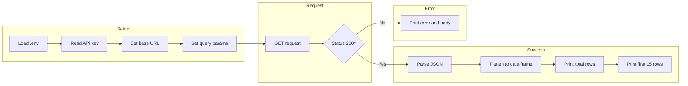

# README `my_good_query.R`

> Documents the FDA Device Recall API script: endpoint, parameters, data structure, and how to run it.

---

## Table of Contents

- [Overview](#overview)
- [API Endpoint and Parameters](#api-endpoint-and-parameters)
- [Data Structure](#data-structure)
- [Flow Diagram](#flow-diagram)
- [Usage Instructions](#usage-instructions)

---

## Overview

[`my_good_query.R`](my_good_query.R) queries the **FDA Open Data API** for **device recalls**. It requests up to 1,000 records (the API maximum per request) for recalls initiated in **2024**, then prints the first 15 rows of key fields. The script uses an API key loaded from a `.env` file and returns a data frame of recall records suitable for reporting or analysis.

---

## API Endpoint and Parameters

| Item | Value |
|------|--------|
| **Base URL** | `https://api.fda.gov/device/recall.json` |
| **Method** | GET (query parameters) |

**Query parameters:**

| Parameter | Required | Description |
|-----------|----------|-------------|
| `api_key` | Yes* | API key from `.env` (`TEST_API_KEY`). *Required for higher rate limits. |
| `search` | No | Lucene-style filter. Example: `event_date_initiated:[2024-01-01 TO 2024-12-31]` for 2024 recalls. |
| `limit` | No | Max records per request (default 100). Script uses `1000` (FDA max). |

**Example request (conceptually):**

```
GET https://api.fda.gov/device/recall.json?api_key=YOUR_KEY&search=event_date_initiated:[2024-01-01 TO 2024-12-31]&limit=1000
```

---

## Data Structure

The API returns JSON with a **`results`** array of recall objects. Each element is one recall; the script flattens this into a data frame.

**Key fields (among others):**

| Field | Description |
|-------|-------------|
| `recall_number` | FDA recall identifier |
| `event_date_initiated` | Date the recall was initiated |
| `product_code` | Product classification code |
| `root_cause_description` | Description of the root cause |

**Top-level response shape:**

- `meta` — metadata (e.g. result count, disclaimer)
- `results` — array of recall objects (one per row when flattened)

The script subsets to the columns above when they exist and prints the first 15 rows.

---

## Flow Diagram



**Summary:** Load API key and build URL/params → send GET → on success, parse JSON, flatten to a data frame, and print total count plus first 15 rows; on failure, print status and response body.

---

## Usage Instructions

### 1. Dependencies

Install and load in R:

```r
install.packages("httr")
install.packages("jsonlite")
library(httr)
library(jsonlite)
```

### 2. API Key and `.env`

- Create a `.env` file in `01_query_api/` (or adjust the path in the script).
- Add a line: `TEST_API_KEY=your_fda_api_key_here`.
- Get a key from [FDA Open Data](https://open.fda.gov/apis/authentication/) if you need higher rate limits.

### 3. Run the Script

From the project root or from `01_query_api/`:

```bash
# From repo root (script path and .env path are absolute in script)
Rscript 01_query_api/my_good_query.R
```

Or in R:

```r
source("01_query_api/my_good_query.R")
```

**Note:** The script uses a hardcoded path to `.env` (`/Users/yashvi711/Desktop/Cornell/Classes/dsai/01_query_api/.env`). If you move the project or run from another machine, update that path in the script.

### 4. Expected Output

- A line indicating the query (e.g. “Querying FDA API for 2024 Recalls...”).
- On success: status 200, total number of records, and the first 15 rows of `recall_number`, `event_date_initiated`, `product_code`, and `root_cause_description` (when present).
- On failure: error status and the response body.

---


---

← 🏠 [Back to Top](#Table-of-Contents)
