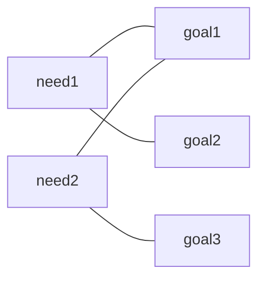

# 📌 ACTIVITY

## Project Design for AI Product

🕒 *Estimated Time: 5–10 minutes*

---

## ✅ Your Task

Sketch a simple process diagram for your proposed homework tool and write a short summary that maps **stakeholder needs** to **system goals**. Your idea and design are tentative and can be changed in the future.

### 🧱 Define Your Tool

- [ ] Name your homework tool idea in one sentence (e.g., *Data Reporter*, *Doc Fixer*).
- [ ] List 1–2 **stakeholders** and one need each (e.g., *Instructor — needs one-page press release*; *Student — needs clean data for analysis*).
- [ ] List 2–3 **system goals** using core functions such as **SUMMARIZE**, **FORMAT**, **INTERPRET**, or **FIX**.
- [ ] Map the goals of your system to the needs of your stakeholders. Eg:

**Example ideas:**

| Idea | Input → Output | Key function |
|------|----------------|--------------|
| Data Reporter | Raw data → 1-page `.docx` press release | SUMMARIZE, FORMAT |
| Documentation maker | Notes / API → `.md` docs | FORMAT, INTERPRET |
| Doc fixer | JSON or CSV with typos → corrected file | FIX, FORMAT |
| Symptom explainer | Short symptom list → plain-language summary + when to see a doctor | SUMMARIZE, INTERPRET |
| Med reminder | Prescription label / notes → daily schedule + reminder text | FORMAT, INTERPRET |
| Vocab quizzer | Word list + language → fill-in-blank or multiple-choice quiz | FORMAT, INTERPRET |
| Conversation prompter | Topic + level → dialogue prompts or role-play scenarios | FORMAT, INTERPRET |
| Schedule optimizer | To-do list + deadlines → suggested order or calendar blocks | INTERPRET, FORMAT |
| Meeting summarizer | Transcript or notes → bullet summary + action items | SUMMARIZE, FORMAT |
| Stats explainer | Dataset or model output → short interpretation (“what this means”) | INTERPRET, SUMMARIZE |
| Report checker | Draft report + rubric → feedback on structure and missing sections | INTERPRET, FIX |

---

# 📤 To Submit

- For credit: Submit a screenshot/written summary of your project design in the CANVAS text box.

---

---

← 🏠 [Back to Top](#ACTIVITY)
