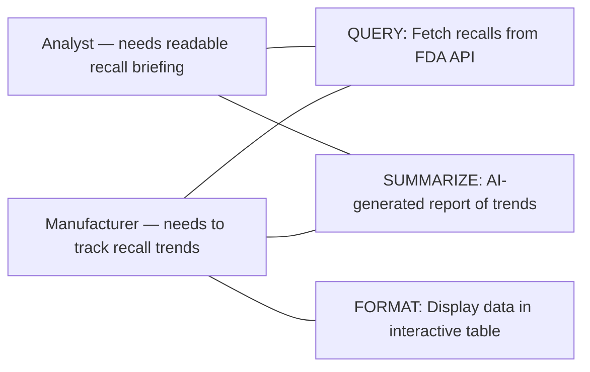

# Project Design: FDA Recall Reporter

## Tool Name

**FDA Recall Reporter** — an AI-powered tool that queries FDA device recall data, displays it interactively, and generates plain-language summary reports.

---

## Stakeholders and Needs

| Stakeholder | Need |
|-------------|------|
| **Public health analyst** | Needs a quick, readable summary of recent FDA device recalls to include in team briefings |
| **Medical device manufacturer** | Needs to monitor recall trends and root causes relevant to their product category |

---

## System Goals

| # | Goal | Core Function |
|---|------|---------------|
| 1 | Fetch device recall records from the FDA API for a user-specified date range | **QUERY** |
| 2 | Display raw recall data in a clean, filterable interactive table | **FORMAT** |
| 3 | Use AI to generate a plain-language summary report of recall trends | **SUMMARIZE** |

---

## Stakeholder Needs → System Goals

---

## How It Maps to Homework 1

| Homework Component | Status | File |
|--------------------|--------|------|
| API Integration | Done | [`01_query_api/my_good_query.R`](../01_query_api/my_good_query.R) |
| Web Interface (Shiny) | Done | [`02_productivity/shiny_app/app.R`](shiny_app/app.R) |
| AI Reporting | To do (LAB 3) | Will use Ollama or OpenAI to summarize recall data |

---

## Input → Output

**Input:** User selects a month/year range and record limit in the Shiny sidebar.

**Output:**
1. Interactive table of FDA device recalls (recall number, date, product code, root cause, recalling firm)
2. AI-generated summary report highlighting top root causes, most-recalled firms, and trends

**Key functions:** QUERY, FORMAT, SUMMARIZE
