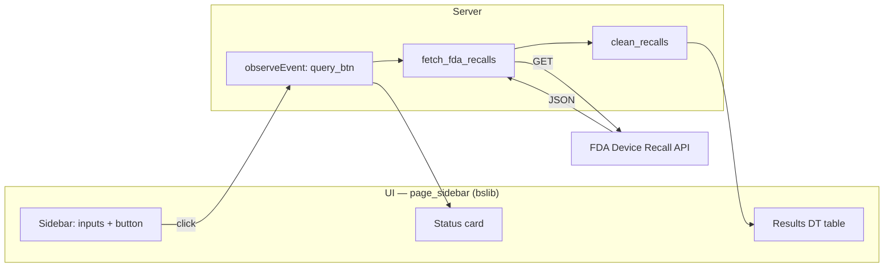

# FDA Device Recall Explorer

A Shiny dashboard that queries the [FDA Open Data API](https://open.fda.gov/apis/device/recall/) for medical device recalls and displays results in an interactive, filterable table. Built from the query in [`01_query_api/my_good_query.R`](../../01_query_api/my_good_query.R).

## Table of Contents

- [Quick Start](#quick-start)
- [Installation](#installation)
- [How to Run](#how-to-run)
- [API Requirements](#api-requirements)
- [Usage](#usage)
- [Architecture](#architecture)
- [Project Structure](#project-structure)
- [Screenshots](#screenshots)

## Quick Start

```r
# 1. Open R or RStudio
# 2. Set working directory to the shiny_app folder
setwd("02_productivity/shiny_app")

# 3. Run the launcher (installs missing packages automatically)
source("run.R")
```

The app opens in your browser. Pick a year range, choose a record limit, and click **Query FDA Recalls**.

## Installation

Install the required R packages (one time):

```r
install.packages(c("shiny", "bslib", "httr", "jsonlite", "DT", "dplyr"),
                 repos = "https://cloud.r-project.org")
```

Or just run `source("run.R")` — it checks for missing packages and installs them automatically.

## How to Run

| Method | Command |
|--------|---------|
| **Launcher script** | `setwd("02_productivity/shiny_app"); source("run.R")` |
| **From project root** | `shiny::runApp("02_productivity/shiny_app")` |
| **RStudio** | Open `app.R`, click **Run App** |

## API Requirements

- **API**: [FDA Open Data — Device Recall](https://open.fda.gov/apis/device/recall/)
- **Key**: The API key is included in `helpers.R`. If you need your own, register at [open.fda.gov](https://open.fda.gov/apis/authentication/) and update the `FDA_API_KEY` variable.
- **Rate limits**: FDA allows ~240 requests per minute with a key. The app makes one request per button click.

## Usage

1. **Set year range** — Use the Start year and End year inputs in the sidebar (defaults to 2024).
2. **Pick max records** — Choose 10 to 1000 (FDA's max per request is 1000).
3. **Click Query FDA Recalls** — The app hits the FDA API and populates the table.
4. **Explore results** — Use column filters, search, sorting, and pagination in the table. Click the full-screen icon to expand.
5. **Error handling** — Invalid year ranges, network failures, and API errors show clear messages in the Status card.

## Architecture



- **`helpers.R`** — API key, `fetch_fda_recalls()` (HTTP + error handling), `clean_recalls()` (column selection).
- **`app.R`** — UI layout with `page_sidebar()`, server logic with reactive values, DT table rendering.
- **`run.R`** — Installs missing packages and launches the app.

## Project Structure

```
shiny_app/
├── app.R          # Main Shiny app (UI + server)
├── helpers.R      # API helper functions
├── run.R          # Launcher script (auto-installs packages)
├── DESCRIPTION    # Dependency manifest
└── README.md      # This file
```

## Screenshots

*(Add your own screenshots here for submission.)*

- **App interface** — Sidebar with query controls, empty table before first query.
- **Successful query** — Green status alert showing record count, table populated with recalls.
- **Error handling** — Red alert when year range is invalid or API returns an error.

---

*Built for SYSEN 5381 — implements the FDA recall query from `my_good_query.R` as an interactive Shiny dashboard.*
