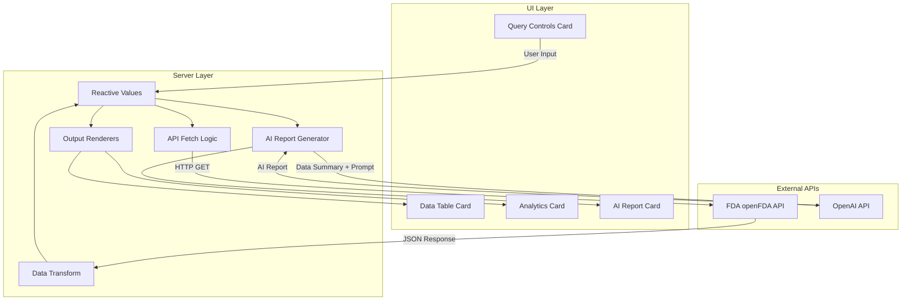

# FDAi

AI-powered FDA medical device recall dashboard. Queries the openFDA API, displays interactive visualizations, and generates executive reports using OpenAI.

## Table of Contents

- [Quick Start](#quick-start)
- [Features](#features)
- [Architecture](#architecture)
- [Usage Guide](#usage-guide)
- [API Requirements](#api-requirements)
- [Project Structure](#project-structure)
- [Dependencies](#dependencies)
- [Troubleshooting](#troubleshooting)

## Quick Start

**Run the app:**

```r
source("run.R")
```

Or from command line:
```bash
cd 02_productivity/shiny_app
Rscript run.R
```

**Install dependencies** (if needed):
```r
pkgs <- c("shiny", "bslib", "httr", "jsonlite", "DT", "plotly", "dplyr", "markdown")
install.packages(pkgs, repos = "https://cloud.r-project.org")
```

The app will open in your default browser at `http://127.0.0.1:3838`.

## Features

- **Interactive Date Range Selection**: Query recalls for any date range from 2010 to present
- **Real-time API Queries**: Fetches data directly from the FDA openFDA API
- **Searchable Data Table**: Filter and sort recall records with instant search
- **Visual Analytics**: 
  - Top root causes bar chart
  - Monthly recall trends line chart
- **AI-Powered Reports**: Generate executive summaries with trends, concerns, and recommendations via OpenAI (gpt-4o-mini)
- **Report Download**: Export AI-generated reports as Markdown files
- **Error Handling**: Graceful handling of API errors and empty results
- **Modern UI**: Clean, responsive interface using bslib Bootstrap theming

## Architecture



## Usage Guide

### 1. Set Query Parameters

- **Start Date**: Beginning of the date range for recalls
- **End Date**: End of the date range for recalls  
- **Max Records**: Maximum number of records to fetch (1-1000)

### 2. Fetch Data

Click the **Fetch Data** button to query the FDA API. The status message will show:
- Loading indicator while fetching
- Success message with record count
- Error message if the request fails

### 3. Explore Results

- **Data Table**: Browse all recall records with:
  - Column filters at the top of each column
  - Global search box
  - Sortable columns
  - Pagination controls
  
- **Analytics Charts**:
  - **Top Root Causes**: Horizontal bar chart showing the most common reasons for recalls
  - **Monthly Trends**: Line chart showing recall frequency over time

### 4. Generate AI Report

Click the **Generate Report** button in the AI Analysis Report section to get an executive summary including:
- Overview of the recall landscape
- Key trends and patterns
- Top concerns
- Actionable recommendations

Reports can be downloaded as Markdown files.

### 5. Full Screen Mode

Click the expand icon on any card to view in full screen.

## API Requirements

### FDA API Key (Optional)

The app works without an API key but is subject to rate limits (40 requests per minute).

For higher rate limits, obtain a free API key:

1. Visit [openFDA API Keys](https://open.fda.gov/apis/authentication/)
2. Register for a free API key
3. Add to your `.env` file:
   ```
   API_KEY=your_fda_api_key_here
   ```

### OpenAI API Key (Required for AI Reports)

To use the AI report generation feature:

1. Get an API key from [OpenAI](https://platform.openai.com/api-keys)
2. Add to your `.env` file:
   ```
   OPENAI_API_KEY=your_openai_key_here
   ```

The app loads keys from `.env` files in the app folder, parent directories, or the project root.

## Project Structure

```
shiny_app/
├── app.R           # Main Shiny application (UI + Server + AI reporting)
├── run.R           # Launcher script with dependency check
├── DESCRIPTION     # Package metadata and dependencies
├── README.md       # This documentation
└── .env            # Optional: API key configuration
```

## Dependencies

| Package | Purpose |
|---------|---------|
| `shiny` | Web application framework |
| `bslib` | Bootstrap theming |
| `httr` | HTTP requests to FDA and OpenAI APIs |
| `jsonlite` | JSON parsing |
| `DT` | Interactive data tables |
| `plotly` | Interactive visualizations |
| `dplyr` | Data manipulation |
| `markdown` | Rendering AI report markdown as HTML |

## Troubleshooting

### App won't start

**Missing packages**: Run the dependency installation command above.

**Port in use**: The app defaults to port 3838. If busy, R will automatically try another port.

### No data returned

- **Check date range**: Ensure start date is before end date
- **Try smaller range**: Very large ranges may timeout
- **API rate limit**: Wait a minute and try again

### API errors

- **Status 429**: Rate limit exceeded. Wait or add an API key.
- **Status 500**: FDA server error. Try again later.
- **Network error**: Check your internet connection.

### AI Report issues

- **OPENAI_API_KEY not found**: Ensure the key is in your `.env` file
- **OpenAI API error**: Check your API key is valid and has credits

---

**Based on**: [`my_good_query.R`](../../01_query_api/my_good_query.R) - Original FDA Device Recalls API query script | [`ai_reporter.py`](../../03_query_ai/ai_reporter.py) - Original AI reporting script

**API Documentation**: [openFDA Device Recall API](https://open.fda.gov/apis/device/recall/) | [OpenAI Chat Completions](https://platform.openai.com/docs/api-reference/chat)

---

**Last Updated**: March 2026
