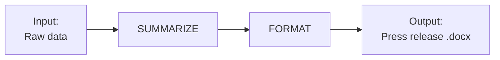

# 📌 ACTIVITY

## Project Process Diagram for AI Product

🕒 *Estimated Time: 10 minutes*

---

## ✅ Your Task

Draw a **process diagram** for your homework tool (inputs → steps → outputs) and write a short **mapping** of stakeholder needs to system goals. Use your project from [ACTIVITY_project_design](../02_productivity/ACTIVITY_product_design.md).

### 🧱 Process Diagram

- [ ] Choose your tool’s main **inputs** (e.g., raw data, notes, CSV file).
- [ ] Choose 2–4 **steps** (e.g., SUMMARIZE, FORMAT, INTERPRET, FIX) that turn inputs into outputs.
- [ ] Choose the **output(s)** (e.g., press release, cleaned CSV, quiz).
- [ ] Draw the process **by hand** or **in Mermaid**. Keep the diagram simple.

**Example — Data Reporter (Mermaid):**

---

# 📤 To Submit

- For credit: Submit a screenshot of your process diagram.

---

---

← 🏠 [Back to Top](#ACTIVITY)
