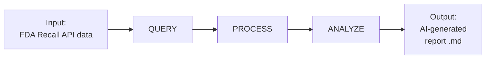

# FDA Device Recall Reporter — Process Diagram

- **Input**: Raw JSON records from the FDA Open Data device recall API (up to 1000 recall records for 2024).
- **QUERY**: Send a GET request to the FDA API, retrieve recall records filtered by date range.
- **PROCESS**: Clean the data, parse dates, and aggregate summary statistics (monthly counts, top root causes, top product codes).
- **ANALYZE**: Send the processed summary to OpenAI (GPT-4o-mini) with a structured prompt requesting trends, root causes, and recommendations.
- **Output**: A markdown report containing an executive summary, monthly trends, top root causes, and actionable recommendations.

## Stakeholder Needs → System Goals

| Stakeholder | Need | System Goal |
|---|---|---|
| Device manufacturers | Understand common recall causes | Summarize top root causes with counts |
| Regulatory analysts | Track recall trends over time | Aggregate recalls by month and surface patterns |
| Public health officials | Identify high-risk product categories | Rank product codes by recall frequency |
| Decision-makers | Get actionable insights quickly | Generate a concise AI report with recommendations |
