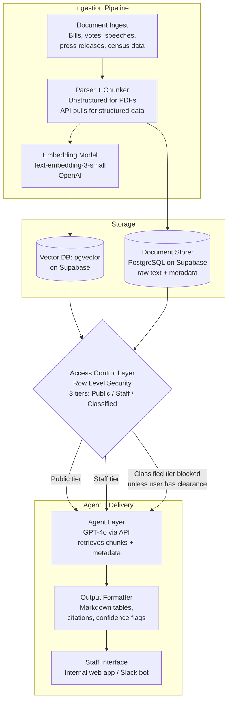

# LAB: AI Architecture Design for a Congressional Agent — Completed

---

## Task 1: Focal Agent — Option B: The Coalition Builder

### Design Decisions

**What data does it query?**

- **Voting records**: Roll call votes from Congress.gov, filtered by policy area (e.g., environment, defense, healthcare). The agent retrieves each member's yea/nay/abstain history on bills tagged with relevant topics.
- **Co-sponsorship history**: Bills the member has co-sponsored, especially those similar in scope or policy area to the proposed bill.
- **Public statements**: Floor speeches, press releases, and official social media posts stored in the congressional database, embedded and retrievable by semantic similarity to the proposed bill.
- **Party affiliation and caucus memberships**: Structured metadata used as a lightweight signal (e.g., membership in the Congressional Progressive Caucus or the Problem Solvers Caucus).
- **District demographics**: Census-level summaries (median income, industry mix, urban/rural split) attached to each member's district, useful for inferring constituent pressure on certain issues.

**How does it handle members who have never voted on a similar issue?**

The agent flags these members explicitly as "Insufficient Data" in the confidence column. It falls back on (1) co-sponsorship of thematically adjacent bills, (2) caucus membership, and (3) public statements. If none of those exist either, the member is listed as "No Basis for Prediction" rather than omitted — so the user knows the gap exists.

**What does its output look like?**

A structured markdown table ranking members, followed by a data gaps section and a strategy note.

### System Prompt

```
You are a legislative strategy analyst AI. Your job is to identify which members
of Congress are most likely to support a proposed bill, based on evidence retrieved
from the congressional database.

RETRIEVAL SCOPE:
You have access to the following data sources via retrieval:
  1. Roll call voting records (tagged by policy area)
  2. Co-sponsorship history
  3. Public statements (floor speeches, press releases)
  4. Member metadata (party, state, district demographics, caucus memberships)

RULES:
- Rank likely supporters from most to least likely, with a brief justification
  grounded in specific retrieved evidence.
- Categorize each member as: LIKELY SUPPORT | LEAN SUPPORT | UNCERTAIN | LEAN OPPOSE | LIKELY OPPOSE.
- For each prediction, cite the specific evidence: a vote (bill number + date),
  a co-sponsorship, or a direct quote from a public statement.
- If a member has never voted on a related issue AND has no relevant co-sponsorships
  or public statements, mark them as "INSUFFICIENT DATA" — do not guess.
- Never fabricate a voting record, bill number, or quote.
- If retrieved documents are insufficient to rank more than a handful of members,
  say so and recommend the user request a broader data pull.

OUTPUT FORMAT:
Return a markdown table:

| Rank | Member | State/Party | Predicted Position | Key Evidence | Confidence |
|------|--------|-------------|-------------------|--------------|------------|

Followed by:

DATA GAPS: [List any members with insufficient data and what is missing]
STRATEGY NOTE: [1-2 sentences on which members might be persuadable and why]
CONFIDENCE DISCLAIMER: Predictions are based on historical patterns and retrieved
documents only. They do not account for private negotiations, leadership pressure,
or unreported positions.
```

---

## Task 2: System Architecture

### Mermaid Diagram



### Design Questions

**How are documents ingested and chunked?**

Structured data (voting records, co-sponsorships, member metadata) is pulled nightly via the Congress.gov API and stored as rows in PostgreSQL — no chunking needed. Unstructured data (floor speeches, press releases, PDFs of bills) is parsed using the `Unstructured` library, split into ~500-token chunks with 50-token overlap, and embedded with OpenAI's `text-embedding-3-small`. Both the raw text and the vector embedding are stored, so the agent can retrieve the chunk and reference the full source document.

**How is access control enforced?**

Row Level Security (RLS) in Supabase/PostgreSQL. Every document row has a `clearance_level` column (`public`, `staff`, `classified`). When a user authenticates, their API token carries a role claim. The RLS policy filters out any row where the user's clearance is below the document's level. The agent never sees filtered-out rows — they simply do not appear in query results. This is safer than prompt-level instructions because the agent cannot accidentally leak what it never received.

**What database stores the vectors? What stores the raw documents?**

Both live in the same Supabase PostgreSQL instance. Vectors are stored in a `document_embeddings` table using the `pgvector` extension. Raw documents and metadata live in a `documents` table. They share a foreign key so the agent can retrieve a chunk's embedding match and then pull the full source text for citation.

**Does the agent see raw documents, retrieved chunks, or summaries?**

The agent sees retrieved chunks (the top-k most relevant by cosine similarity), plus structured metadata (member name, party, state, vote record). It does not see full raw documents — that would blow up the context window. If the user asks for more detail, the interface links to the full document in the document store.

**What happens when a user queries something above their clearance level?**

Nothing alarming — the classified rows are simply excluded by RLS before the query reaches the agent. The agent responds based on whatever it *can* see. If the filtered results are too thin to make a recommendation, the agent says "Insufficient retrieved data to answer this query" and suggests the user request access through their office's security officer. The system never reveals that classified documents exist or were filtered.

---

## Task 3: Justification

I chose Row Level Security (RLS) enforced at the database layer because it is the only access control mechanism that makes classified data invisible to the agent itself. A prompt-level instruction like "do not discuss classified material" is dangerously brittle — the model might ignore it, leak information in a summary, or be jailbroken. With RLS, classified rows never enter the retrieval results, so the agent literally cannot reference them. This aligns with the lab tip that "an AI that ignores classified content because RLS filtered it out is safer than one instructed to not discuss classified content." In a congressional setting where leaked classified material could have national security consequences, defense-in-depth at the data layer is non-negotiable.

The single biggest failure mode is hallucinated evidence — the agent fabricating a vote, a bill number, or a quote that sounds plausible but is wrong. In a coalition-building context, acting on a false prediction (e.g., "Senator X voted yes on a similar bill in 2023" when they did not) could lead to embarrassing or strategically damaging outreach. I mitigate this in three ways: (1) the system prompt requires the agent to cite specific retrieved evidence and forbids fabrication; (2) the output format includes a confidence column and a "data gaps" section that surfaces uncertainty rather than hiding it; and (3) the retrieval architecture limits the agent to retrieved chunks rather than parametric memory, reducing the surface area for hallucination. A human staffer should still verify key claims before acting on them.

This design reflects concerns raised by Fagan about algorithmic decision systems operating in high-stakes domains without adequate transparency. Fagan argues that when automated tools influence consequential decisions — sentencing, risk assessment, and by extension legislative strategy — the system must make its reasoning auditable and its limitations visible. My architecture addresses this by requiring per-row citations, explicit confidence ratings, and a data gaps disclosure, so staffers can trace every prediction back to a specific vote or statement. The system is designed to augment human judgment, not replace it: the "Strategy Note" at the end is framed as a suggestion, and the confidence disclaimer reminds users that the model cannot account for private negotiations or leadership dynamics.

---
